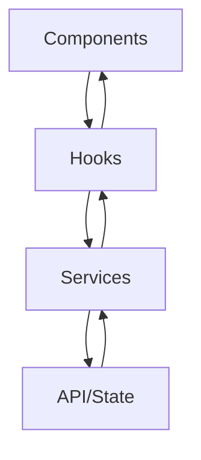

# Aeris Wallet Structure

## Project Structure

```bash
src/
├── app/                          # Next.js App Router
│   ├── layout.tsx               # Root layout with providers
│   ├── page.tsx                 # Main dashboard
│   ├── ask/
│   │   └── page.tsx            # AI assistant page
│   ├── auth/
│   │   └── page.tsx            # Authentication page
│   ├── buy/
│   │   └── page.tsx            # Buy crypto page
│   ├── receive/
│   │   └── page.tsx            # Receive crypto page
│   ├── send/
│   │   └── page.tsx            # Send crypto page
│   ├── settings/
│   │   └── page.tsx            # Settings page
│   └── swap/
│       └── page.tsx            # Swap tokens page
├── features/                     # Feature-based modules
│   ├── ai/
│   │   ├── components/         # UI Components
│   │   ├── hooks/             # React hooks for AI
│   │   ├── services/          # Pure business logic
│   │   └── types/             # TypeScript definitions
│   ├── assets/
│   │   ├── components/
│   │   │   ├── token-list.tsx
│   │   │   └── token-item.tsx
│   │   ├── hooks/
│   │   │   └── use-tokens.tsx
│   │   ├── services/
│   │   │   └── token-service.ts
│   │   └── types/
│   │       └── token.types.ts
│   ├── auth/
│   │   ├── components/
│   │   │   ├── login-form.tsx
│   │   │   └── onboarding.tsx
│   │   ├── hooks/
│   │   │   └── use-auth.tsx
│   │   ├── services/
│   │   │   └── auth-service.ts
│   │   └── types/
│   │       └── auth.types.ts
│   ├── nfts/
│   │   ├── components/
│   │   ├── hooks/
│   │   ├── services/
│   │   └── types/
│   ├── shared/
│   │   ├── components/
│   │   │   ├── loading-screen.tsx
│   │   │   ├── error-display.tsx
│   │   │   └── responsive-dialog.tsx
│   │   ├── hooks/
│   │   │   ├── use-copy-to-clipboard.tsx
│   │   │   └── use-okto-client.tsx
│   │   ├── services/
│   │   │   └── chain-service.ts
│   │   └── types/
│   │       └── shared.types.ts
│   ├── transactions/
│   │   ├── components/
│   │   ├── hooks/
│   │   ├── services/
│   │   └── types/
│   └── wallet/
│       ├── components/
│       ├── hooks/
│       ├── services/
│       └── types/
├── lib/                         # Pure utility functions
│   ├── utils/
│   │   ├── format.ts
│   │   └── explorer.ts
│   ├── constants/
│   │   └── config.ts
│   └── types/
│       └── global.types.ts
└── hooks/                       # Shared React hooks
    ├── use-persistence.ts
    └── use-sync.ts
```

## Architectural Principles

### 1. Feature-First Organization

- Each feature is self-contained with its own components, hooks, services, and types
- Features can share code through the shared feature module
- Clear boundaries between features improve maintainability

### 2. Clean Separation of Concerns

- `lib/`: Pure utility functions without React dependencies
- `features/*/services/`: Pure business logic
- `features/*/hooks/`: React-specific logic
- `hooks/`: Shared React hooks
- `app/`: Next.js pages and layouts

### 3. State Management

- Legend State for global state management
- TanStack Query for server state
- Local state when appropriate
- Persistent storage with IndexedDB

### 4. Data Flow



## Key Components

### Dashboard Components

- `WalletHeader`: Navigation and options
- `BalanceDisplay`: Total balance with privacy toggle
- `ActionButtons`: Primary actions
- `TabNavigation`: Main navigation tabs
- `TokenList`: Asset listing
- `TransactionHistory`: Activity log
- `NFTGallery`: NFT display

### Modal Components

- `SendModal`: Transfer interface
- `SwapModal`: Token swap interface
- `BuyModal`: Purchase interface
- `ReceiveModal`: Receive address

### Shared Components

- `LoadingScreen`: Loading states
- `ErrorDisplay`: Error handling
- `ResponsiveDialog`: Modal dialogs

## Implementation Guidelines

### 1. Component Creation

- Use TypeScript for all components
- Implement proper error boundaries
- Add loading states
- Include accessibility features

### 2. Hook Usage

- Create custom hooks for reusable logic
- Use Legend State hooks for global state
- Implement TanStack Query for API calls

### 3. Service Implementation

- Pure functions without side effects
- Clear input/output types
- Error handling
- Logging where appropriate

### 4. Testing Strategy

- Unit tests for services
- Integration tests for hooks
- E2E tests for critical flows
- Performance monitoring
