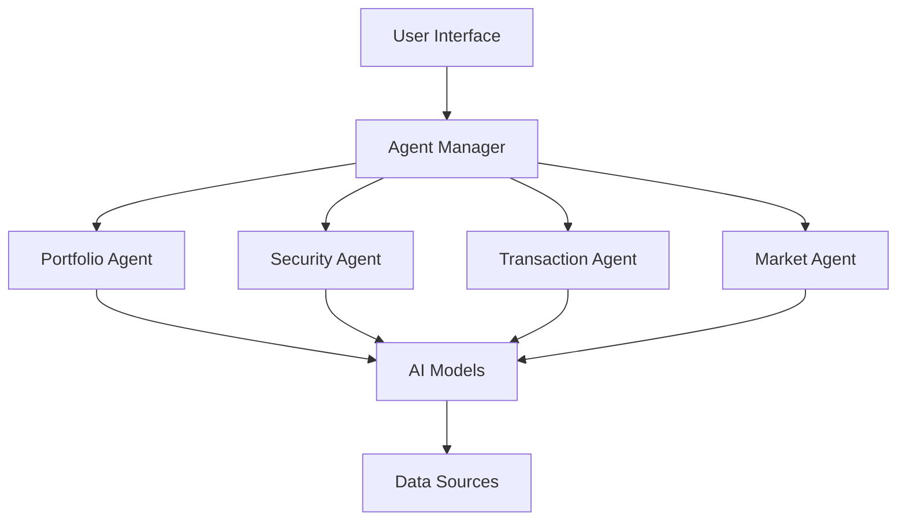
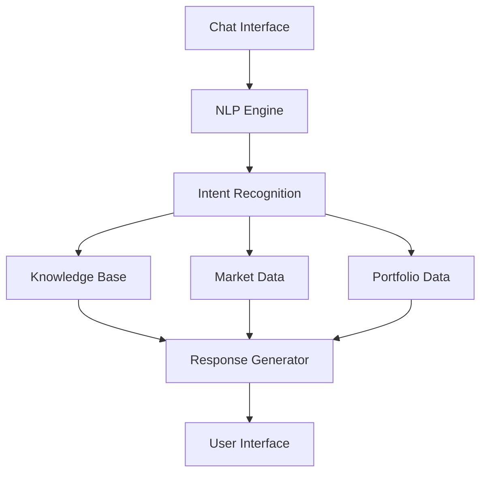

# Aeris Wallet Architecture Design

## Overview

Aeris Wallet is a PWA (Progressive Web App) that combines Web2 and Web3, providing an intuitive interface for managing crypto assets. The architecture is designed to support advanced AI capabilities, multi-chain operations, and a native user experience.

## System Architecture

### Core Components

1. **Authentication Layer**

    - NextAuth.js for Web2 authentication
    - Okto SDK for wallet authentication
    - Session management and persistence

2. **Wallet Core**

    - Okto SDK for wallet operations
    - Account management
    - Multi-chain support
    - Transaction handling

3. **AI Layer**

    - AI Agent system for autonomous management
    - Conversational AI for assistance
    - Natural language processing
    - Market analysis & insights

4. **UI Layer**

    - PWA capabilities
    - Offline-first architecture
    - Real-time synchronization
    - Fine-grained reactivity

5. **Data Layer**

    - Legend State for global state
    - TanStack Query for remote data
    - IndexedDB for persistence
    - Sync queue management

## AI Integration Design

### AI Agent System

The AI agent system operates as a background service that can:

1. **Portfolio Management**

    - Performance analysis
    - Automatic rebalancing
    - Risk management
    - Yield optimization

2. **Transaction Optimization**

    - Gas monitoring
    - Optimal timing
    - Batch transactions
    - MEV protection

3. **Security & Risk**

    - Fraud detection
    - Smart contract analysis
    - Protocol evaluation
    - Security alerts

4. **Market Intelligence**

    - Market analysis
    - Trend prediction
    - Arbitrage opportunities
    - DeFi insights

**Implementation Architecture:**

### Conversational AI Assistant

The AI assistant provides a natural interface for:

1. **Portfolio Insights**

    - Performance analysis
    - Recommendations
    - Operation history
    - Projections

2. **Market Research**

    - Token analysis
    - Market trends
    - Relevant news
    - Sentiment analysis

3. **Educational Content**

    - Custom tutorials
    - Protocol explanations
    - DeFi strategies
    - Best practices

4. **Transaction Assistant**

    - Step-by-step guide
    - Operation validation
    - Cost estimations
    - Natural language confirmations

**Implementation Architecture:**

## Performance & Scalability

### Client-Side Optimization

1. **State Management**

    - Fine-grained reactivity con Legend State
    - Optimistic updates
    - Offline-first capabilities

2. **Data Loading**
    - Intelligent prefetching
    - Progressive loading
    - Cache management

### AI System Scalability

1. **Agent System**

    - Distributed processing
    - Queue management
    - Priority handling

2. **Model Optimization**
    - Model compression
    - Lazy loading
    - Edge inference

## Implementation Roadmap

### Phase 1: Core Wallet

1. PWA implementation
2. Authentication system
3. Basic wallet operations

### Phase 2: AI Foundation

1. AI agent infrastructure
2. Basic portfolio management
3. Initial conversational AI

### Phase 3: Advanced Features

1. Automated strategies
2. Advanced market analysis
3. Multi-chain optimization

### Phase 4: Business Model

1. AI as a Service
2. Premium features
3. Custom agent development

## Future Considerations

### AI Expansion

1. Custom agent creation
2. Advanced automation
3. Social trading features

### Platform Growth

1. Multi-device sync
2. Institutional features
3. API marketplace
